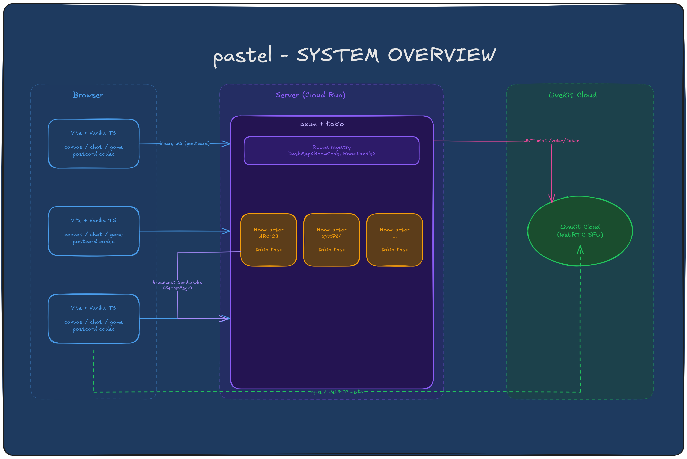
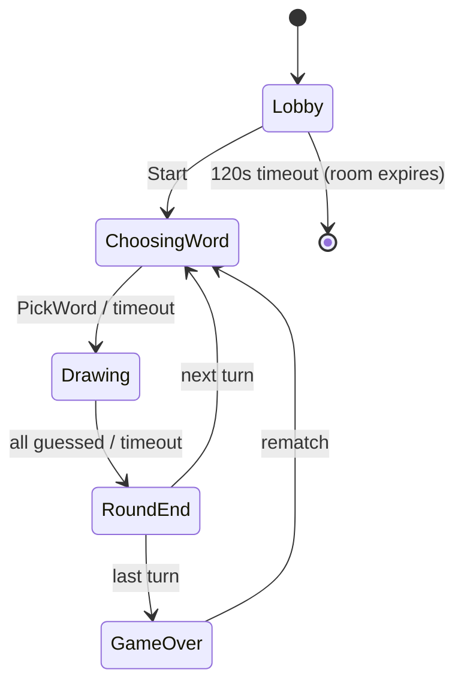
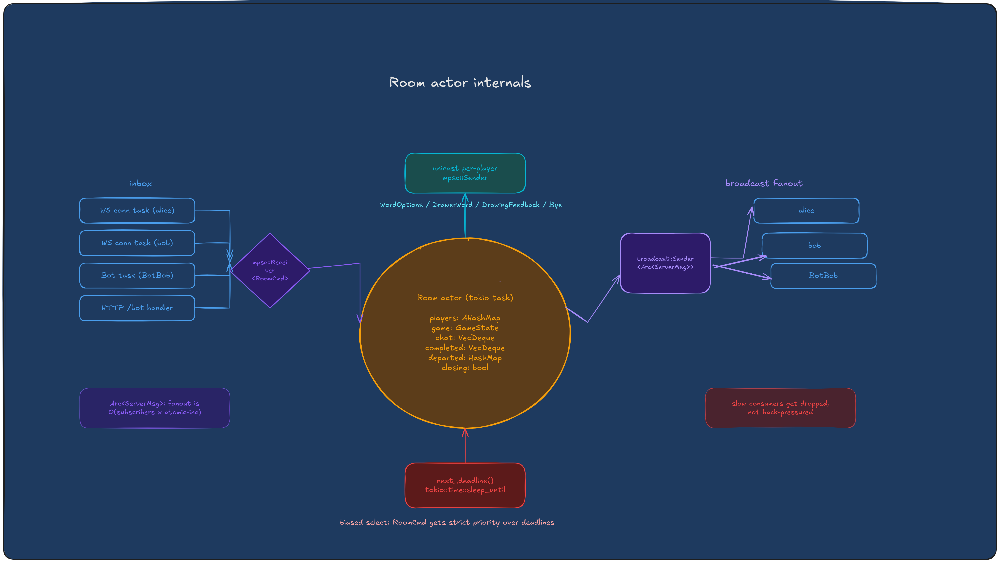

<div align="center">

# pastel

**Real-time multiplayer drawing & guessing.**

No accounts. No ads. No JSON. Just grab a link and draw.

Rust on the back. TypeScript on the front. Binary WebSockets between.

</div>


https://github.com/user-attachments/assets/5d0c977b-6995-44a9-b730-a60cd85d396d


<p align="center">
  
</p>

---

## Table of contents

- [The game in 30 seconds](#the-game-in-30-seconds)
- [Features](#features)
- [Run it locally](#run-it-locally)
- [Tests & quality checks](#tests--quality-checks)
- [Load test](#load-test)
- [Deploy](#deploy)
- [Engineering deep dives](#engineering-deep-dives)
- [Repo layout](#repo-layout)
- [How it stacks up against skribble](#how-it-stacks-up-against-skribble)
- [Credits](#credits)
- [What's next](#whats-next)

---

## The game in 30 seconds

Pick a mode. Start a room. Share the link.

When a friend joins, hit "Let's go!" Or add a bot.

| Mode | Rounds | Words offered |
|---|---:|---:|
| Sprint | 3 | 7 |
| Standard | 5 | 5 |
| Marathon | 7 | 3 |

Every player draws once per round. The drawer picks a word, everyone else
guesses in chat. Hints reveal automatically (one letter at 60s, 30s, 10s
remaining). First correct guess scores most, each next earns 0.7x of the
previous. The drawer earns half the round total.

A room sits in the lobby for **120 seconds** before it expires and frees
its six-character code. The host sees a live countdown.

---

## Features

### Gameplay
- Three modes: Sprint (3 rounds), Standard (5), Marathon (7)
- Mode-driven word offering: 7 / 5 / 3 choices respectively
- Per-round drawer rotation, every player draws once
- Auto hint reveal at 60s, 30s, 10s remaining
- Tiered scoring: first correct guesser scores most, each next gets 0.7x
- Drawer earns half the round total
- Close-guess detection via Levenshtein distance, surfaced as a private "so close!" pill
- Two-minute lobby expiry with live countdown so dead rooms free their codes

### Voice
- Opt-in per room from the landing page
- LiveKit Cloud + WebRTC under the hood
- 500KB SDK lazy-loaded only when the mic is tapped
- Pre-warmed in parallel with the avatar picker if you ticked the voice toggle
- Green ring + bouncing equalizer on active speakers' avatars
- Per-speaker mute on your end without telling anyone
- Bg music ducks automatically while your mic is live so it doesn't bleed through WebRTC

### Reactions
- Guessers can tap "looking good" (sparkle) or "i'm lost" (question) during a round
- Each reaction broadcasts as a small system line in chat
- When 50%+ of guessers agree on a mood, the drawer sees a soft pastel banner
  ("they're loving it" or "they're a bit lost, try clearer strokes")
- Resets every round

### Audio
- Three CC0 lofi tracks fade between scenes (landing, lobby, in-game)
- Short procedural Tone.js SFX for round start, correct guess, round end, join, game over
- Separate toggles for bg music and sfx, both persist in localStorage, both default on
- Music auto-ducks under live voice

### Avatars
- DiceBear big-smile, five customisable parts (skin, hair, eyes, mouth, accessory)
- Persisted in localStorage, reused on reload
- Bots get their own avatars
- Host gets a tiny coral dot at the avatar's top-right
- Bots get a grey dot at the bottom-right
- You get an ink-coloured ring around your own avatar
- Idle bounce in the lobby

### Bots
- Three difficulties: chill, normal, sweaty
- Real human sketches from Google Quick Draw (295 words, 30KB binary asset)
- Tiered bot word pool so a bot never picks a word it has no drawing for
- Per-difficulty guess pacing only; drawing speed is identical and feels human
- Personality chat: greets on join, reacts to others' correct guesses, announces own turn, reacts to reveals
- Bots never hold the host badge; an all-bot room auto-shuts-down

### Reload safety
- Per-browser `client_token` UUID in localStorage
- Reload skips the avatar picker entirely
- Server matches the token against a `departed` map and restores the original `PlayerId`
- Same row on the scoreboard, same accumulated score, same rotation slot
- Bye-on-room-close routes to a friendly "this room is gone" screen

### Host controls
- First human joiner is host, never a bot
- Kick with approval flow: kicked tokens get held until the host approves a rejoin
- Host transfer skips bots and picks the oldest remaining human
- Canvas-event pill + chat system line announce the change

### Scoreboard
- Filtered to players currently in the room (departed players keep score internally for resumption)
- Animated score pops on change
- Sorted by rank with #1, #2, #3 markers
- Correct guessers row gets a pink-turquoise gradient highlight

### Canvas
- Fixed 960x600 logical coordinate space, DPI-aware backing store
- Quadratic Bezier midpoint smoothing, velocity-modulated width
- Strokes chunked at 64 points per batch
- Persistent replay model survives resize, DPI change, and reload
- Non-drawers can scribble while others draw, only they see it
- Floating event pills for "wiped the canvas", "got it!", "is now the host"

---

## Run it locally

Stable Rust (edition 2021), Node 20+, npm. Two terminals:

```sh
# Backend
cargo run -p pastel-server
# listens on 0.0.0.0:7070

# Frontend
cd frontend && npm install && npm run dev
# Vite at http://127.0.0.1:5173, proxies /ws, /bot, /voice to the backend
```

Add a bot from the CLI:

```sh
curl -X POST 'http://localhost:7070/bot/ROOMCODE?difficulty=medium'
```

Voice is optional. Create a project at [cloud.livekit.io](https://cloud.livekit.io)
and drop your three keys into `crates/pastel-server/.env`:

```
LIVEKIT_URL=wss://your-project.livekit.cloud
LIVEKIT_API_KEY=...
LIVEKIT_API_SECRET=...
```

`.env` is gitignored. The server runs fine without these; voice rooms just
return a `503 voice not configured` from `GET /voice/token`.

---

## Tests & quality checks

```sh
# Correctness
cargo test --workspace        # 75+ tests
cd frontend && npm test       # 48 tests

# Lint, format, typecheck
cargo fmt --all
cargo clippy --workspace --all-targets -- -D warnings
cd frontend && npm run typecheck && npm run build
```

Pre-commit hook runs `cargo fmt --check` on `.rs` files.

Test highlights:
- Cross-codec hex fixtures (Rust + TS must agree on bytes)
- Proptest round-trip on every wire variant
- Virtual-time game tests (`tokio::time::pause` + `advance`)
- Kicked-rejoin flow: approve, reject, candidate disconnect, fresh-token bypass
- Same-browser rejoin restores the original `PlayerId`
- Departed players are filtered from RoundEnd / GameOver scoreboards
- Bot-only rooms auto-shutdown; lobby times out at 120s; Start cancels the expiry
- Host transfer skips bots; bots joining first do not become host
- Real WebSocket integration tests against in-process axum

---

## Load test

### Local (loopback)

1000 concurrent WebSocket clients, 125 rooms, 30 seconds, 10 strokes/s each:

```
connections: 1000/1000 (0 failed)
throughput:  300k sent, 2.4M broadcast (8x fanout)
p50:         0.13 ms
p95:         0.27 ms
p99:         0.35 ms
max:         46.21 ms
```

p99 round-trip under half a millisecond. Faster than one animation frame at 60 Hz.

```sh
cargo run --release -p pastel-loadtest -- \
    --clients 1000 --per-room 8 --duration 30 --rate 10
```

### Production (Cloud Run, asia-south1)

Same binary, pointed at the deployed instance over `wss://`. Single Cloud
Run instance (2 vCPU, 2 GiB, concurrency 200, min/max instances = 1).

| Phase | Setup | Connections | Errors | p50 | p95 | p99 |
|---|---|---:|---:|---:|---:|---:|
| Smoke | 50 clients, 7 rooms, 5 strokes/s, 20s | 50 / 50 | 0 | 31 ms | 145 ms | 173 ms |
| Realistic-scale steady-state | 200 clients, 25 rooms, 5 strokes/s, 30s | 200 / 200 | 0 | 215 ms | 2.2 s | 5.0 s |
| Realistic stroke rate | 200 clients, 25 rooms, **2 strokes/s**, 30s | 200 / 200 | 0 | 35 ms | 490 ms | 2.2 s |
| Handshake burst (200) | 200 connect-only joins | 200 / 200 | 0 | — | — | — |
| Handshake burst (500) | 500 connect-only joins | 500 / 500 | 0 | — | — | — |

Throughput at phase 2: 30,000 sends, 240,000 broadcasts, fanout 8.00x.
Handshake throughput across phases 4a / 4b: 148 / 282 full
TLS + WS + Hello + Welcome round-trips per second.

```sh
# Steady-state
cargo run --release -p pastel-loadtest -- \
    --addr wss://<your-cloud-run-url> \
    --clients 200 --per-room 8 --duration 30 --rate 2

# Pure handshake throughput (no stroke loop)
cargo run --release -p pastel-loadtest -- \
    --addr wss://<your-cloud-run-url> \
    --clients 500 --per-room 8 --connect-only --duration 1 --rate 0
```

**Read of the data.** p50 at the realistic 2 strokes/s rate is 35 ms,
essentially equal to the laptop -> asia-south1 RTT floor. The wire
protocol and room actor disappear into the network latency. Connection
setup and fanout both held to zero errors across every phase. One single
Cloud Run instance comfortably supports ~200 concurrent players spread
over 25 rooms while sustaining a 280-handshake/sec join burst.

#### What's working

- **100% connection success across every phase.** 50, 200, and 500
  TLS + WebSocket handshakes all landed cleanly. No dropped joins, no
  retry storms, no LB rejections.
- **Zero wire errors.** 270k+ stroke broadcasts in the realistic-scale
  test, every one of them parsed cleanly on the client side. The
  postcard codec and validator hold up under real production traffic
  end-to-end.
- **Perfect 8x fanout under load.** The room actor delivered every
  stroke to every subscriber in the realistic-scale phase. No silent
  drops, no broadcast-lag bypasses, no orphaned subscribers.
- **Network-floor p50 at realistic rates.** 35 ms RTT means the wire
  format + room actor + Cloud Run + TLS stack collectively add a few
  hundred microseconds on top of physics. There is no perceptible
  protocol overhead to optimise away.
- **Excellent handshake throughput.** 282 fresh joins/sec from a single
  client machine means a viral link share landing 500 people on the
  room at once is absorbed in under two seconds with no failures.
- **One small instance does the job.** A single 2 vCPU / 2 GiB Cloud
  Run instance sustains 200 concurrent players (25 rooms) at gameplay
  rates while still having headroom for join bursts. The current
  deployment is production-ready as-is for an early-launch audience.

#### What still needs work

- **The p99 tail at 5 strokes/s** (5.0 s in the steady-state phase). The
  server delivers every frame, but writes queue under high contention on
  one instance. Most likely cause: tokio scheduling fairness across 200
  socket write tasks sharing one runtime. **Plan:** reduce per-stroke
  fanout work (coalesce points by player into bigger batches before the
  broadcast hit), and look at a per-room dedicated runtime if profiling
  confirms the scheduler is the bottleneck. Real users don't sustain
  5 strokes/sec, so this is a "before scale" investigation, not a "now"
  fix.
- **Single-instance ceiling.** Today rooms live in-memory in one actor
  per process, so `--max-instances=1`. The next concurrency jump
  (Cloud Run scale-out, multi-region) needs a shared room registry. A
  Redis-backed lookup keyed by `RoomCode` would let any instance route a
  connection to the room actor's owner (or hand off ownership), without
  changing the per-room actor model. Plumbing is straightforward; not
  needed under 200 concurrent.
- **Handshake-burst tail.** ~4% of close-side WS frames threw transient
  errors during the 500-client burst (teardown races, not connect
  failures). Cosmetic but worth tightening with a graceful `WS_CLOSE`
  + drain loop in the client side before drop.

---

## Deploy

The repo ships a multi-stage `Dockerfile` (Rust builder + Node builder +
slim runtime) that builds in one shot and is ready for Cloud Run.
WebSocket sessions work fine with Cloud Run's 60-minute request timeout.

For production:
- Enable **session affinity** so reconnects land on the same instance
- Set `--min-instances=1` and `--max-instances=1` for the simplest
  topology (rooms live in-memory in one actor; multi-instance needs a
  shared registry, which is on the roadmap)
- Wire LiveKit env vars through Secret Manager. The server reads them
  via `dotenvy` locally and Cloud Run env vars in prod

---

## Engineering deep dives

### Screw JSON

The wire is `postcard`-encoded binary. Each direction is one enum:

```rust
pub enum ClientMsg { Hello, Stroke, Chat, Guess, Game, Pong, React }
pub enum ServerMsg { Welcome, Stroke, Chat, Guess, Presence, Game, Ping, Bye, WordOptions, DrawerWord, JoinPending, DrawingFeedback }
```

A 30-point stroke batch is about 130 bytes. The JSON equivalent is about
600. Across 10 rooms at 60 Hz that is the difference between "fine" and
"you should worry about egress".

The TypeScript codec is hand-written (~300 lines). Both sides assert the
same fixture hex. If either drifts, both builds break.

### One actor per room, no locks



Each room is one `tokio` task that owns its state. Lock-free hot path:

- `mpsc::Receiver<RoomCmd>` inbox from connection tasks
- `broadcast::Sender<Arc<ServerMsg>>` for room-wide fanout (slow consumers
  get dropped, not back-pressured)
- Per-player `mpsc` for unicast (drawer's word, word options, drawing feedback)
- `Arc<ServerMsg>` so fanout is O(subscribers x atomic-inc)

Biased select gives commands strict priority over deadlines.

<p align="center">
  
</p>

### Avatar wire format

7 bytes per player. Each field is a `u8` index into the client-side parts
table. The server validates ranges but treats the bytes as opaque. Art
source can change without touching the wire.

```rust
struct Avatar { skin: u8, hat: u8, hair: u8, eyes: u8, mouth: u8, specs: u8, earrings: u8 }
```

### Bots: real sketches, no AI

No fake AI. No LLM. No image recognition. The bot is a real game client
that runs as a tokio task inside the server process, talking directly to
its `RoomHandle`. Zero WebSocket overhead, zero serialization.

**Drawing.** 295 words have real human sketches from
[Google Quick Draw](https://quickdraw.withgoogle.com/data). A Python script
fetches one recognized drawing per word, encodes stroke coordinates into
a compact binary (word + stroke count + per-stroke u8 x/y deltas), and
writes `drawings.bin` (30KB total). The server `include_bytes!` it at
compile time. At runtime the bot scales Quick Draw's 0-255 coords to the
960x600 canvas with padding, emitting intermediate points when deltas
exceed `i8` range. Strokes replay with human-like timing (300-700ms
between strokes, 60-150ms between batches).

**Guessing.** The bot reads the `word_mask` from `RoundStart`
(e.g. `_ _ _ _ _`), filters the full word pool by character count,
shuffles, and tries candidates one at a time. On each `HintReveal` it
narrows by checking revealed letters. One guess, wait for response,
schedule the next. Pace slows naturally as attempts pile up.

**Words.** Bot drawers are restricted to a curated bot-friendly word list
(easy / medium / hard tiers) so they never pick a word with no drawing.

### Reload as the same player

Each browser persists a `client_token` UUID in localStorage. The room
keeps a `departed: HashMap<token, PlayerId>` that records voluntary
disconnections. On the next `Hello` with that token the join path
recovers the original `PlayerId` before allocating a new one. Kicked
tokens never enter `departed`; they continue to flow through the
host-approval path.

### Room lifecycle

```
spawn_room          -> lobby_deadline = now + 120s, on_close set
handle_leave        -> if humans_left == 0: closing = true
handle_deadline     -> if Lobby and deadline elapsed: closing = true
finalize_close      -> send Bye(RoomClosed) to every slot, run on_close
on_close (Rooms)    -> DashMap::remove(&code)
```

The frontend treats `Bye(RoomClosed)` as a fatal screen so a timed-out
or abandoned room sends every participant a "this room is gone" card.

### Voice: JWTs + lazy SDK

LiveKit Cloud handles the WebRTC; we just mint JWTs. The token endpoint
(`crates/pastel-server/src/voice.rs`) signs with `jsonwebtoken` using
HS256 and the claims LiveKit expects: `iss` is your API key, `sub` is
`name-XXXXXX`, `video` grant maps `room` to the pastel room code,
`roomJoin / canPublish / canSubscribe` all true.

The frontend dynamic-imports `livekit-client` only on first mic tap.
That keeps the main bundle at ~360KB / 105KB gzip. The voice chunk is
500KB / 132KB gzip and only loaded for users who actually want voice.

If you opt into voice on the landing page, both the chunk and the
LiveKit room connection are warmed in parallel with the avatar picker
so the only post-tap cost is the browser mic permission and the publish.

### Canvas rendering

Fixed logical 960x600 coordinate space. Backing store sized to
`cssSize x devicePixelRatio` for crisp Retina rendering. Pointer events
converted CSS to logical via `getBoundingClientRect`. Quadratic Bezier
midpoint smoothing, velocity-modulated width. Strokes chunked at 64
points per batch. A persistent `completedStrokes` model lets the canvas
survive resize, DPI change, and reload.

---

## Repo layout

```
crates/
  pastel-proto/        wire types, codec, validation, proptest fixtures
  pastel-room/         per-room actor, game state machine, scoring, lifecycle
  pastel-server/       axum + WS, room registry, bot spawner, LiveKit tokens
  pastel-loadtest/     simulated WS clients, standalone bot, Quick Draw data
frontend/
  public/music/        three CC0 lofi tracks (landing / lobby / game)
  src/main.ts          the wire-up
  src/proto.ts         ClientMsg / ServerMsg codec + types
  src/canvas.ts        pointer capture, Bezier, DPI, replay model
  src/avatar.ts        DiceBear big-smile render + parts table
  src/avatarPicker.ts  name + avatar picker modal, hasStoredIdentity helpers
  src/voice.ts         LiveKit client wrapper (lazy-loaded)
  src/music.ts         HTMLAudioElement bg scene switcher + procedural sfx
  src/chat.ts          chat panel with avatar chips + guess mode
  src/game.ts          client game state + mode options
  src/gameUI.ts        lobby, word pick, round end, game over overlays + countdown
  src/roundIntro.ts    animated round-start card with scoreboard
  src/canvasEvent.ts   floating event pills over the canvas
  src/toast.ts         transient notifications
  src/dialog.ts        custom confirm dialogs
  src/kicked.ts        fatal + pending screens
  src/landing.ts       centered landing with mode tiles + voice opt-in
  src/toolbar.ts       brushes, palette, clear (single-pen on mobile)
  src/ws.ts            WebSocket client, backoff, resume_from
```

---

## How it stacks up against skribble

skribble.io is great. We just wanted a version with the things that always
nagged us:

- **Voice chat baked in.** Talk to your room while you draw. Skribble has
  none of this.
- **Lofi soundtrack that fits the vibe.** Different track per scene.
  Skribble is silent.
- **Bots that draw real human sketches.** Powered by Google Quick Draw,
  not a fake AI. Skribble's bots don't draw at all.
- **Reactions during the round.** Guessers can signal "looking good" or
  "i'm lost" and the drawer sees a banner when half the room agrees.
- **Reload = same player.** Browser fingerprint via localStorage means a
  refresh doesn't make you a stranger with a new score.
- **Binary wire (postcard).** A 30-point stroke batch is 130 bytes here,
  ~600 in JSON. Fewer bytes on every fanout to every player.
- **Cute hand-drawn avatars with a parts editor.** Skribble's are stick
  figures.

We're not trying to replace skribble. Just making something we actually
want to play with friends.

---

## Credits

Made with:

- [open-lofi](https://github.com/btahir/open-lofi) for the three CC0 background tracks
- [DiceBear](https://www.dicebear.com/styles/big-smile) for the avatar parts
- [LiveKit](https://livekit.io) for the WebRTC plumbing
- [Phosphor Icons](https://phosphoricons.com/) for the UI iconography
- [Google Quick Draw](https://quickdraw.withgoogle.com/data) for the bot sketches

---

## What's next

Team mode. Two teams play in parallel, each with their own canvas, word,
and drawer rotation. Stroke broadcasts are team-scoped. The wire already
carries `TeamId` fields. See `.docs/notes/ROADMAP.md` for the full plan.
