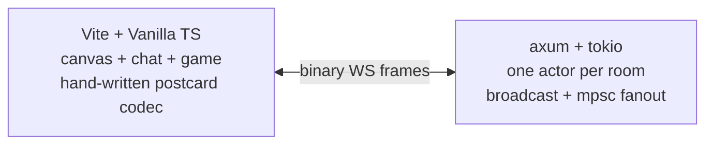
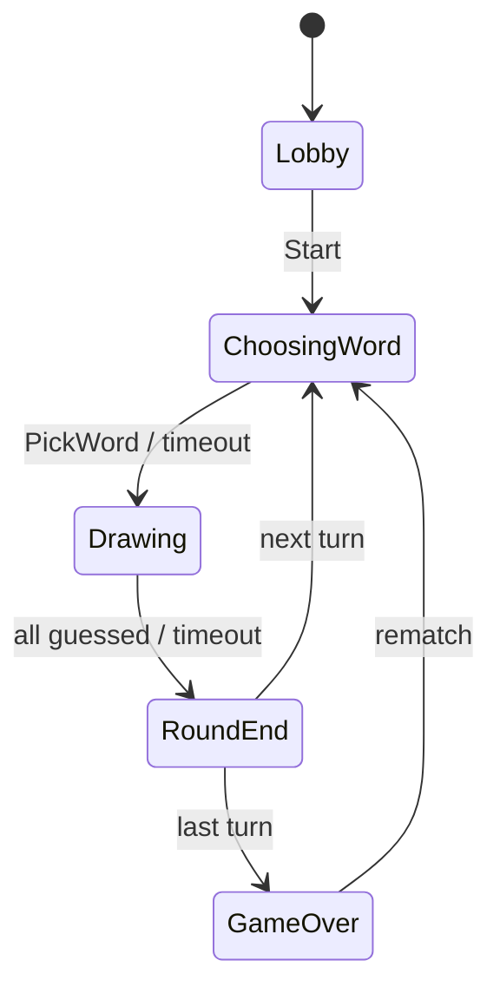

# pastel

A real-time multiplayer drawing and guessing game that actually feels good
to play. No accounts, no ads, no JSON. Just grab a link and draw.

Built with Rust + TypeScript. Binary WebSocket protocol. One actor per room.
Sub-millisecond fanout. Cute chibi avatars. Bots that draw real things.



## What you get

Open the landing page. Pick a mode. **Start a room.** Share the link.
When a friend joins, hit "Let's go!" Or just add a bot.

### The game

Three paces, pick your vibe:

| Mode      | Rounds | Words offered |
|-----------|-------:|-------------:|
| Sprint    | 3      | 7            |
| Standard  | 5      | 5            |
| Marathon  | 7      | 3            |

Every player draws once per round. The drawer picks a word, everyone else
guesses in chat. Hints reveal automatically (one letter at 60s, 30s, 10s
remaining). First correct guess scores most, each subsequent guesser gets
0.7x less. The drawer earns half the total.

Close guesses get a "so close!" pill. Only the guesser sees it.
Everyone else just sees the attempt in chat.

### Avatars

DiceBear chibi avatars with 5 customizable parts (skin, hair, eyes, mouth,
accessory). Pick your look when you join a room. The picker has a live
preview and a "Surprise me" button. Your avatar shows up everywhere:
player list, chat, banner, round intro, scoreboard.

### Bots

Can't find a friend? Add a bot. Three flavors:

| Bot | Guess speed | Drawing | Personality |
|-----|------------|---------|-------------|
| chill | 25-50s, patient | slow, careful | "ohhh", "should have got that" |
| normal | 10-25s, steady | same | "nice one!", "big brain" |
| sweaty | 3-10s, rapid-fire | same | "how??", "too easy" |

Bots draw using real human sketches from Google's Quick Draw dataset.
295 words with actual stroke data, replayed with natural timing.
They guess by matching the word mask against the full word list,
narrowing candidates as hints reveal letters.

Bot names: lil crayon, smudge, inkbean, brushie, sketchy, doodlebug,
soft pencil, chalky, tintsy, hue, palette, swatch, and more.

### Quality of life

- **Host controls**: kick players (they need approval to rejoin), host
  auto-transfers when the current host leaves with a chat announcement
- **Close guess detection**: Levenshtein distance catches near-misses
- **Score pop**: scores animate when they change, players sort by rank (#1, #2...)
- **Correct-guesser highlight**: pink-turquoise gradient on their row
- **Round intro card**: animated card on each round showing the drawer
  and cumulative scoreboard
- **Canvas events**: floating pills for "wiped the canvas", "got it!", "is now the host"
- **Guess mode indicator**: chat input turns purple with a "guessing" badge
  when you're the guesser
- **Reload safety**: rejoin mid-round with canvas, scores, timer, and chat intact
- **Non-drawer doodling**: you can scribble while others draw, only you see it

### The feel

- **Plus Jakarta Sans** (body) + **Fredoka** (display) fonts
- Pink-turquoise gradient background across all screens
- Notebook feel: dashed borders on cards, faint ruled lines on canvas, paper grain
- 3D-press buttons everywhere (offset shadow that compresses on click)
- Pastel color palette: softened coral errors, mint accents, cream surfaces
- Avatar idle bounce in the lobby
- Smooth overlay transitions with scale-in animation
- Toast notifications instead of native alerts
- Custom confirm dialogs instead of `window.confirm`
- Responsive: 3-column (desktop), 2-column (medium), stacked (mobile)

## Run it locally

Stable Rust (edition 2021), Node 20+, npm.

```sh
git clone <repo> && cd skribble
cd frontend && npm install && cd ..
```

Two terminals:

```sh
cargo run -p pastel-server
# listens on 0.0.0.0:7070
```

```sh
cd frontend && npm run dev
# Vite at http://127.0.0.1:5173, proxies /ws and /bot to the backend
```

To add a bot from the CLI:

```sh
curl -X POST http://localhost:7070/bot/ROOMCODE?difficulty=medium
```

## Engineering

### Screw JSON

The wire is `postcard`-encoded binary. Each direction is one enum:

```rust
pub enum ClientMsg { Hello(..), Stroke {..}, Chat {..}, Guess {..}, Game(..), Pong {..} }
pub enum ServerMsg { Welcome {..}, Stroke {..}, Chat {..}, Guess {..}, Game {..}, ... }
```

A 30-point stroke batch is ~130 bytes. The JSON equivalent is ~600 bytes.
Across 10 rooms at 60 Hz, that's the difference between "fine" and
"you should worry about egress."

The TypeScript codec is hand-written (~300 lines). Both sides assert the
same fixture hex. If either drifts, both builds break.

### One actor per room, no locks



Each room is one `tokio` task that owns its state. Lock-free hot path:

- `mpsc::Receiver<RoomCmd>` inbox from connection tasks
- `broadcast::Sender<Arc<ServerMsg>>` for room-wide fanout (slow consumers
  get dropped, not back-pressured)
- Per-player `mpsc` for unicast (drawer's word, word options)
- `Arc<ServerMsg>` so fanout is O(subscribers x atomic-inc)

Biased select gives commands strict priority over deadlines.

### Avatar wire format

7 bytes per player. Each field is a `u8` index into the client-side parts
table. The server validates ranges but treats the bytes as opaque. Art
source can change without touching the wire.

```rust
struct Avatar { skin: u8, hat: u8, hair: u8, eyes: u8, mouth: u8, specs: u8, earrings: u8 }
```

### Bot architecture

No fake AI, no LLM, no image recognition. The bot is a real game client
that runs as a tokio task inside the server process, talking directly to the
`RoomHandle` (zero WebSocket overhead, zero serialization).

**Drawing**: 295 words have real human sketches from Google's Quick Draw
dataset (millions of crowd-sourced doodles, open data). A Python script
fetches one recognized drawing per word from Google Cloud Storage, encodes
the stroke coordinates into a compact binary format (word + stroke count +
per-stroke points as u8 x/y pairs), and writes `drawings.bin` (30KB for
all 295). The server `include_bytes!` it at compile time. At runtime, the
bot scales Quick Draw's 0-255 coordinate space to our 960x600 canvas with
padding, emitting intermediate points when deltas exceed i8 range. Strokes
replay with human-like timing (300-700ms between strokes, 60-150ms between
batches).

**Guessing**: the bot doesn't know the word. It reads the `word_mask` from
`RoundStart` (e.g. "_ _ _ _ _"), filters the full 1500+ word pool by
matching character count, shuffles the candidates, and tries them one at a
time. On each `HintReveal`, it narrows the candidate list by checking
revealed letters against each candidate. It sends one guess, waits for the
server's response (correct or not), then schedules the next attempt. Pace
slows naturally over attempts (base delay + 300ms per attempt, capped at +3s).

**Difficulty** controls only the guess timing:

| Difficulty | First guess delay | Between guesses | Personality |
|------------|-------------------|-----------------|-------------|
| chill | 25-50s | 5-9s + slowdown | relaxed, often wrong |
| normal | 10-25s | 3-5s + slowdown | steady, decent aim |
| sweaty | 3-10s | 1.2-2.5s + slowdown | rapid-fire, scary |

Drawing speed is the same for all (it should feel human).

**Chat**: bots greet on join ("hey everyone!"), react to others guessing
correctly ("nice one!", "big brain"), announce their turn ("my turn!",
"watch this"), and react to round-end reveals ("ohhh", "that was tough").
40-50% chance per event so they don't spam.

The bot spawns via `POST /bot/:code?difficulty=easy|medium|hard`.
Frontend has subtle dashed pills in the lobby: "+ chill bot", "+ normal bot",
"+ sweaty bot".

### Kicked-rejoin flow

When the host kicks a player, their `client_token` (UUID in localStorage)
is recorded. If they reconnect, the server returns `JoinOutcome::Pending`
instead of admitting them. The candidate sees a waiting overlay; the host
sees approve/reject buttons. Uses a `oneshot::Sender<ApprovalResult>`
per pending candidate.

### Canvas rendering

Fixed logical **960 x 600** coordinate space. Backing store sized to
`cssSize x devicePixelRatio` for crisp Retina rendering. Pointer events
converted CSS -> logical via `getBoundingClientRect`. Quadratic Bezier
midpoint smoothing, velocity-modulated width. Strokes chunked at 64
points per batch. A persistent `completedStrokes` model lets the canvas
survive resize, DPI change, and reload.

## Repo layout

```
crates/
  pastel-proto/        wire types, codec, validation, proptest fixtures
  pastel-room/         per-room actor, game state machine, scoring
  pastel-server/       axum + WS, room registry, bot spawner, word loader
  pastel-loadtest/     simulated WS clients, standalone bot binary, Quick Draw data
frontend/
  src/main.ts          the wire-up
  src/proto.ts         ClientMsg / ServerMsg codec + types
  src/canvas.ts        pointer capture, Bezier, DPI, replay model
  src/avatar.ts        DiceBear big-smile render + parts table
  src/avatarPicker.ts  name + avatar picker modal
  src/chat.ts          chat panel with avatar chips + guess mode
  src/game.ts          client game state + mode options
  src/gameUI.ts        lobby, word pick, round end, game over overlays
  src/roundIntro.ts    animated round-start card with scoreboard
  src/canvasEvent.ts   floating event pills over the canvas
  src/toast.ts         transient notifications
  src/dialog.ts        custom confirm dialogs
  src/kicked.ts        fatal + pending screens
  src/landing.ts       centered landing with 3D-press mode tiles
  src/toolbar.ts       brushes, palette, clear
  src/ws.ts            WebSocket client, backoff, resume_from
```

## Tests

```sh
cargo test --workspace        # 65+ tests
cd frontend && npm test       # 40 tests
```

Highlights:
- Cross-codec hex fixtures (Rust + TS must agree on bytes)
- Proptest round-trip on every wire variant
- Virtual-time game tests (`tokio::time::pause` + `advance`)
- Kicked-rejoin flow: approve, reject, candidate disconnect, fresh-token bypass
- Host transfer broadcast test
- Avatar range validation test
- Real WebSocket integration tests against in-process axum

## Load test

1000 concurrent WebSocket clients, 125 rooms, 30 seconds, 10 strokes/s each:

```
connections: 1000/1000 (0 failed)
throughput:  300k sent, 2.4M broadcast (8x fanout)
p50:         0.13 ms
p95:         0.27 ms
p99:         0.35 ms
max:         46.21 ms
```

p99 round-trip under half a millisecond. Faster than one animation frame
at 60 Hz.

```sh
cargo run --release -p pastel-loadtest -- \
    --clients 1000 --per-room 8 --duration 30 --rate 10
```

## Lint, format, typecheck

```sh
cargo fmt --all
cargo clippy --workspace --all-targets -- -D warnings
cd frontend && npm run typecheck && npm run build
```

Pre-commit hook runs `cargo fmt --check` on `.rs` files.

## What's next

Team mode. Two teams play in parallel, each with their own canvas, word, and
drawer rotation. Stroke broadcasts are team-scoped. The wire already carries
`TeamId` fields. See `.docs/notes/ROADMAP.md` for the full plan.
